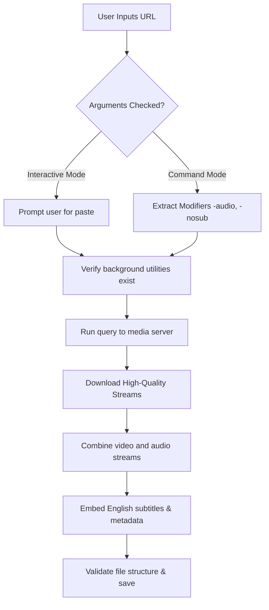

<div align="center">
  <h1>Social Media Downloader</h1>
  <p><b>A modern, high-performance Windows CLI media downloader.</b></p>
  <p>
    <a href="https://github.com/JakkaMadhu/Social-Media-Downloader/releases">
      
    </a>
    
    
    <a href="https://github.com/JakkaMadhu/Social-Media-Downloader/releases">
      
    </a>
  </p>

  <p><b>Download high-quality videos and audio tracks from YouTube, Instagram, Facebook, TikTok, Twitter/X, and 1,000+ sites using a single command: <code>grab</code>.</b></p>
</div>

---

## Table of Contents
- [Key Features](#key-features)
- [Installation](#installation)
  - [Recommended: One-Click Installer](#recommended-one-click-installer)
  - [Manual (Portable) Installation](#manual-portable-installation)
- [Usage & Commands](#usage--commands)
  - [1. Download Video (Default)](#1-download-video-default)
  - [2. Download Audio (MP3)](#2-download-audio-mp3)
  - [3. Download Playlists](#3-download-playlists)
  - [4. Custom Output Naming](#4-custom-output-naming)
  - [5. Disable Subtitles](#5-disable-subtitles)
  - [6. Keep Tool Updated](#6-keep-tool-updated)
- [How It Works (Under the Hood)](#how-it-works-under-the-hood)
- [Troubleshooting](#troubleshooting)
- [License](#license)

---

## Key Features

| Feature | Description |
| :--- | :--- |
| **1000+ Websites Supported** | Works out-of-the-box with YouTube, Facebook, Instagram (Reels/Posts), TikTok, Twitter/X, Reddit, Twitch, Vimeo, and more. |
| **Clean Console Output** | Filters out noisy background connection logs to display only clean progress percentages. |
| **Automated Subtitles** | Downloads and embeds English subtitles (`en*`) directly into the final video file (`.mkv`) on the fly. |
| **Smart Playlist Management** | Automatically groups playlist tracks into a sub-folder and sequences them numerically. |
| **Lock-File Resilience** | Employs 10x auto-retries for rename/move actions, bypassing blocks from Windows Defender or OneDrive sync. |
| **Interactive Paste Mode** | Simply run `grab` to paste links directly, avoiding command-prompt URL breaking without needing double quotes. |

---

## Installation

### Recommended: One-Click Installer
The easiest way to install and keep the downloader configured globally:
1. Go to the [Releases](https://github.com/JakkaMadhu/Social-Media-Downloader/releases) section.
2. Download **`SocialMediaDownloader-v1.0.0-Setup.exe`**.
3. Run the installer. It will automatically:
   * Install the script (`grab.bat`) and all necessary background utilities.
   * Add the installation path to your **User PATH Environment Variable** so the command works anywhere.
4. Launch a new Command Prompt window and type `grab` to start.

---

### Manual (Portable) Installation
If you prefer running the script without installing:
1. Download [grab.bat](grab.bat) from this repository.
2. Ensure you have the core command-line downloader engine and media processing binaries in the same folder as `grab.bat`.
3. Add that directory path to your system's Environment Variables under **Path** to run `grab` from any folder.

---

## Usage & Commands

> [!IMPORTANT]
> When executing commands directly in Command Prompt, always wrap your links in **double quotes (`"..."`)** to prevent Windows from breaking the URL at `&` characters.

### 1. Download Video (Default)
Downloads the highest resolution video streams and embeds auto-generated English subtitles:
```cmd
grab "https://www.youtube.com/watch?v=yye7rSsiV6k"
```

### 2. Download Audio (MP3)
Downloads, extracts, and tags the highest quality audio stream as a standalone MP3 file:
```cmd
grab -audio "https://www.youtube.com/watch?v=yye7rSsiV6k"
```

### 3. Download Playlists
Downloads all tracks in a playlist, creates a clean folder matching the playlist name, and numbers files sequentially:
```cmd
grab "https://www.youtube.com/playlist?list=PL3oW2tjiIxvQ1H8jT2D36H..."
```
* **Download Specific Items:** Extract only specified ranges (e.g. tracks 1 to 5) or individual items:
  ```cmd
  grab -items 1-5 "https://www.youtube.com/playlist?list=..."
  grab -items 1,3,5 "https://www.youtube.com/playlist?list=..."
  ```

### 4. Custom Output Naming
Provide a custom name for the downloaded file (the extension will automatically match the profile format):
```cmd
grab "https://www.youtube.com/watch?v=yye7rSsiV6k" "My Holiday Video"
```

### 5. Disable Subtitles
Skip subtitle downloads and embed actions completely:
```cmd
grab -nosub "https://www.youtube.com/watch?v=yye7rSsiV6k"
```

### 6. Keep Tool Updated
Instantly checks and updates the core downloader engine:
```cmd
grab --update
```

---

## How It Works (Under the Hood)

The `grab` utility automates media extraction through a structured pipeline:



---

## Troubleshooting

> [!TIP]
> **Q: The command 'grab' is not recognized.**
> Ensure you closed and restarted your Command Prompt window after installing. If it still fails, search for "Edit Environment Variables for your account" in Windows, double-click **Path**, and verify that the program directory is listed.

> [!WARNING]
> **Q: Download fails on restricted, private, or age-gated videos.**
> Some media platforms require active accounts or browser credentials to verify access. Try using the public version of the links or ensure you are logged in.

---

## License

This project is licensed under the MIT License. See [LICENSE](LICENSE) for more details.
